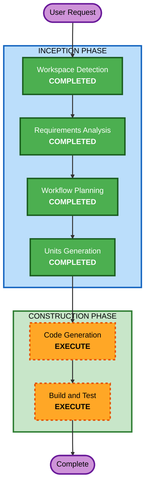

# Execution Plan

## Detailed Analysis Summary

### Transformation Scope
- **Transformation Type**: Multi-component UI/Backend Enhancement
- **Primary Changes**: UI 전체 용어 통일, 대시보드 카드 정확도 개선, 개발 흐름 수정, 설계 페이지 폴더 매핑 뷰, 사이드바 CTA 변경
- **Related Components**:
  - UI 페이지: `page.tsx`(대시보드), `design/page.tsx`, `develop/page.tsx`, `team/page.tsx`, `bundles/page.tsx`, `preflight/page.tsx`, `settings/page.tsx`
  - UI 레이아웃: `Sidebar.tsx`, `TopNav.tsx`, `AppShell.tsx`
  - API 라우트: `api/aidlc/state/route.ts`, `api/aidlc/docs/route.ts`, `api/runs/route.ts`, `api/state/route.ts`
  - 공통 컴포넌트: `Badge`, `Button`, `Card` 등 (변경 없음, 그대로 사용)

### Change Impact Assessment
- **User-facing changes**: Yes — 모든 페이지의 용어, 정보 표시, 네비게이션 변경
- **Structural changes**: No — 기존 아키텍처(Next.js App Router + API Routes) 유지
- **Data model changes**: No — 기존 타입/스키마 유지, UI 표시 레이어만 변경
- **API changes**: Minor — aidlc/state 파서 로직 강화, runs API 응답은 기존 호환
- **NFR impact**: No — 성능/보안/확장성 변경 없음

### Component Relationships
- **Primary Component**: `ui/src/app/` (모든 페이지)
- **Supporting**: `ui/src/app/api/` (API 라우트)
- **Layout**: `ui/src/components/layout/` (Sidebar, TopNav)
- **Shared**: `ui/src/components/ui/` (변경 없음)
- **Core Package**: `src/` (변경 없음)

### Risk Assessment
- **Risk Level**: Low
- **Rollback Complexity**: Easy (UI-only changes, git revert)
- **Testing Complexity**: Simple (자동화된 스냅샷 비교 + API 응답 검증)

---

## Workflow Visualization



### Text Alternative
```
Phase 1: INCEPTION
  - Workspace Detection (COMPLETED)
  - Requirements Analysis (COMPLETED)
  - Workflow Planning (COMPLETED)
  - User Stories (SKIPPED - pure enhancement)
  - Application Design (COMPLETED - unit decomposition artifacts generated)
  - Units Generation (COMPLETED)

Phase 2: CONSTRUCTION
  - Functional Design (SKIPPED - no complex business logic)
  - NFR Requirements (SKIPPED - no NFR changes)
  - NFR Design (SKIPPED)
  - Infrastructure Design (SKIPPED - no infra changes)
  - Code Generation (EXECUTE)
  - Build and Test (EXECUTE)
```

---

## Phases to Execute

### INCEPTION PHASE
- [x] Workspace Detection (COMPLETED)
- [x] Requirements Analysis (COMPLETED)
- [x] User Stories (SKIPPED)
  - **Rationale**: 기존 UI 개선/리팩토링이므로 새 사용자 페르소나 불필요
- [x] Workflow Planning (COMPLETED)
- [x] Application Design (COMPLETED)
  - **Rationale**: 유닛 분해를 위한 설계 아티팩트(unit-of-work.md, dependency matrix, story map) 생성 완료
- [x] Units Generation (COMPLETED)
  - **Rationale**: 8개 요구사항을 6개 독립적 작업 단위로 분해 완료

### CONSTRUCTION PHASE
- [ ] Functional Design (SKIPPED)
  - **Rationale**: 복잡한 비즈니스 로직 없음, UI 텍스트/표시 변경 위주
- [ ] NFR Requirements (SKIPPED)
  - **Rationale**: 성능/보안/확장성 변경 없음
- [ ] NFR Design (SKIPPED)
  - **Rationale**: NFR Requirements 스킵으로 자동 스킵
- [ ] Infrastructure Design (SKIPPED)
  - **Rationale**: 인프라 변경 없음
- [ ] Code Generation (EXECUTE)
  - **Rationale**: 구현 코드 생성 필요
- [ ] Build and Test (EXECUTE)
  - **Rationale**: 빌드 검증 및 테스트 필요

---

## Module Update Strategy
- **Update Approach**: Parallel (독립적 UI 변경 다수)
- **Critical Path**: API 파서 수정 → UI 페이지 수정 (API가 정확한 데이터를 제공해야 UI가 올바르게 표시)
- **Coordination Points**: 용어 체계 상수(terminology constants) 공유
- **Testing Checkpoints**: 각 유닛 완료 후 개별 빌드 검증, 전체 통합 후 `next build`
- **테스트 전략**:
  - **단위 테스트 (Vitest)**: API 파서 스냅샷 테스트, 컴포넌트 렌더링 테스트, 용어 통일 검증
  - **E2E 테스트 (Playwright)**: 대시보드 데이터 정확도 1:1 검증, 네비게이션 흐름, 폴더 매핑 뷰 동작
  - **테스트 인프라**: `api-accuracy` 유닛(Level 0)에서 `vitest.config.ts` 설정 포함

---

## Proposed Units (Graph Nodes)

| Unit | 설명 | 주요 파일 | 의존성 |
|------|------|-----------|--------|
| `api-accuracy` | API 파서 강화 (aidlc-state 파싱, runs 응답 개선) | `api/aidlc/state/route.ts`, `api/aidlc/docs/route.ts` | 없음 |
| `dashboard-cards` | 대시보드 카드 전면 개선 (FR-2,3,5,6) | `app/page.tsx` | `api-accuracy` |
| `sidebar-topnav` | 사이드바 CTA + 용어 통일 + TopNav 정리 (FR-1,7) | `Sidebar.tsx`, `TopNav.tsx` | 없음 |
| `design-page` | 설계 페이지 폴더 매핑 뷰 (FR-8) | `design/page.tsx`, `api/aidlc/docs/route.ts` | `api-accuracy` |
| `develop-page` | 개발 진행 페이지 용어 통일 + 실행 이력 개선 (FR-4,6) | `develop/page.tsx` | 없음 |
| `remaining-pages` | 나머지 페이지 용어 통일 (team, bundles, preflight, settings) | 각 페이지 파일 | `sidebar-topnav` |

### Execution Levels
- **Level 0** (병렬): `api-accuracy`, `sidebar-topnav`, `develop-page`
- **Level 1** (Level 0 완료 후): `dashboard-cards`, `design-page`, `remaining-pages`

---

## Success Criteria
- **Primary Goal**: 모든 UI 페이지에서 정확하고 일관된 정보 표시
- **Key Deliverables**:
  - 에이전트 중심 용어 전체 적용
  - 대시보드 카드 데이터 정확도 100%
  - 개발 흐름 4단계 실제 명령어 기반
  - 설계 페이지 사용자 친화적 폴더 뷰
- **Quality Gates**:
  - `next build` 성공 (타입 에러 없음)
  - 모든 페이지 렌더링 정상 확인
