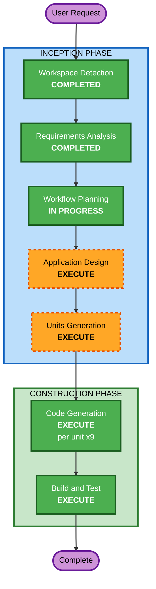

# Execution Plan: ai-crew 하네스 엔지니어링 코어 강화

## Detailed Analysis Summary

### Transformation Scope
- **Transformation Type**: Multi-module enhancement (기존 아키텍처 유지, 새 모듈 추가)
- **Primary Changes**: 코어 하네스(src/)에 9개 기능 추가/개선
- **Related Components**: CLI(cli.ts), 설치기(installer.ts), 그래프 엔진(graph.ts), 타입(types.ts), 카탈로그(catalog/)

### Change Impact Assessment
- **User-facing changes**: Yes — 새 CLI 커맨드(doctor, uninstall, validate), graph.yaml 새 필드
- **Structural changes**: Yes — 새 모듈 추가(validator, verifier, shared-memory, install-state)
- **Data model changes**: Yes — GraphNode 타입 확장(verify, retry), 새 JSON 파일(install-state, shared-memory)
- **API changes**: No — 외부 API 변경 없음
- **NFR impact**: Yes — 그래프 실행 안정성 향상(재시도, 검증, 체크포인트)

### Component Relationships
```
src/cli.ts ─── 새 커맨드 추가 (doctor, uninstall, validate)
     │
src/installer.ts ─── install-state 기록 로직 추가
     │
src/graph.ts ─── retry, verify 필드 처리
     │
src/types.ts ─── GraphNode 타입 확장
     │
[NEW] src/validator.ts ─── 스키마 검증 엔진
[NEW] src/verifier.ts ─── 노드 완료 검증
[NEW] src/shared-memory.ts ─── 에이전트 간 공유 메모리
[NEW] src/install-state.ts ─── 설치 상태 추적
[NEW] src/checkpoint.ts ─── 자동 체크포인트
[NEW] src/session-context.ts ─── 프로젝트 컨텍스트 캐싱
```

### Risk Assessment
- **Risk Level**: Medium
- **Rollback Complexity**: Easy — 각 PR이 독립적이므로 개별 되돌리기 가능
- **Testing Complexity**: Moderate — 기존 테스트 + 새 모듈별 단위 테스트

---

## Workflow Visualization



### Text Alternative
```
Phase 1: INCEPTION
  - Workspace Detection (COMPLETED)
  - Reverse Engineering (SKIPPED - agent exploration으로 대체)
  - Requirements Analysis (COMPLETED)
  - User Stories (SKIPPED - 사용자 대면 기능 없음)
  - Workflow Planning (IN PROGRESS)
  - Application Design (EXECUTE - 새 모듈 설계 필요)
  - Units Generation (EXECUTE - 9 FR을 구현 단위로 분해)

Phase 2: CONSTRUCTION
  - Functional Design (SKIP - 요구사항에 충분히 명세됨)
  - NFR Requirements (SKIP - 요구사항에 이미 포함)
  - NFR Design (SKIP - 인프라 변경 없음)
  - Infrastructure Design (SKIP - 인프라 변경 없음)
  - Code Generation (EXECUTE - 9개 단위, 점진적 PR)
  - Build and Test (EXECUTE)
```

---

## Phases to Execute

### INCEPTION PHASE
- [x] Workspace Detection (COMPLETED)
- [x] Reverse Engineering (SKIPPED — agent exploration으로 대체)
- [x] Requirements Analysis (COMPLETED)
- [x] User Stories (SKIPPED — 순수 엔지니어링, 사용자 대면 기능 없음)
- [x] Workflow Planning (IN PROGRESS)
- [ ] Application Design — **EXECUTE**
  - **Rationale**: 6개 새 모듈(validator, verifier, shared-memory, install-state, checkpoint, session-context)의 인터페이스와 기존 모듈과의 통합 설계가 필요
- [ ] Units Generation — **EXECUTE**
  - **Rationale**: 9개 FR을 각각 독립적으로 구현 가능한 단위로 분해하고, 그래프 노드에 매핑 필요

### CONSTRUCTION PHASE
- [ ] Functional Design — **SKIP**
  - **Rationale**: 요구사항 문서에 각 FR의 기능 명세가 충분히 상세함
- [ ] NFR Requirements — **SKIP**
  - **Rationale**: NFR이 요구사항 문서에 이미 포함 (하위 호환, 테스트, 성능)
- [ ] NFR Design — **SKIP**
  - **Rationale**: 인프라 변경 없음, 패턴 설계 불필요
- [ ] Infrastructure Design — **SKIP**
  - **Rationale**: 인프라 변경 없음
- [ ] Code Generation — **EXECUTE** (per unit, 9회)
  - **Rationale**: 각 FR별 코드 생성 + 테스트
- [ ] Build and Test — **EXECUTE**
  - **Rationale**: 전체 빌드 검증 + 통합 테스트

### OPERATIONS PHASE
- [ ] Operations — PLACEHOLDER

---

## Module Update Strategy
- **Update Approach**: Sequential (PR 순서대로)
- **Critical Path**: FR-7(스키마) → FR-5(재시도) → FR-3(검증) 순서가 중요 (스키마가 새 필드를 정의해야 다른 FR이 그 필드를 사용 가능)
- **Coordination Points**: types.ts (GraphNode 타입 확장이 여러 FR에서 공유)
- **Testing Checkpoints**: 각 PR 병합 전 `npm test` 통과 필수

---

## Success Criteria
- **Primary Goal**: ai-crew 그래프 실행기의 안정성과 신뢰성 강화
- **Key Deliverables**:
  - 6개 새 TypeScript 모듈
  - 3개 새 CLI 커맨드 (doctor, uninstall, validate)
  - 5개 JSON Schema 정의
  - GraphNode 타입 확장 (verify, retry, model 필드)
  - 자동 체크포인트 및 재시도 메커니즘
- **Quality Gates**:
  - 기존 테스트 100% 통과
  - 새 모듈별 단위 테스트 작성
  - 기존 bundle.yaml/graph.yaml 하위 호환성 보장
